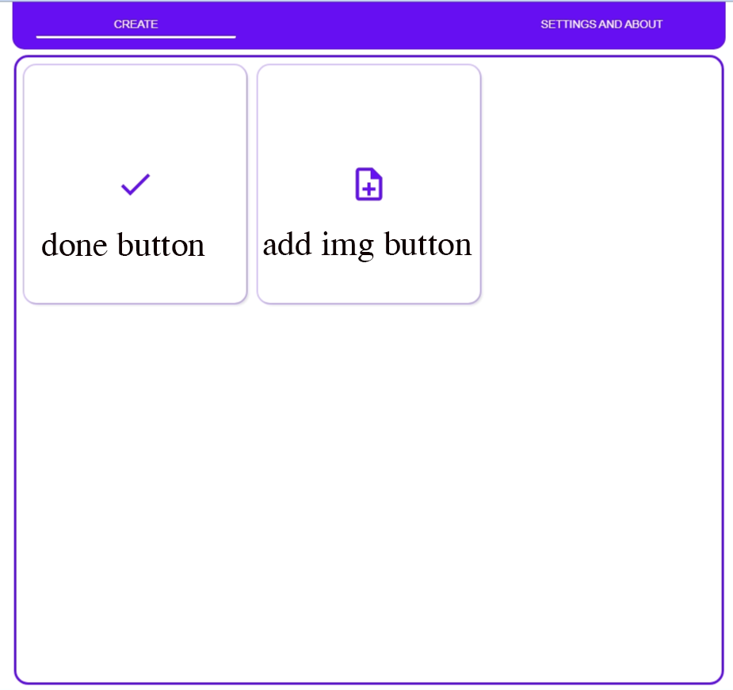

# Guide

click on the create tab then you will get interface like below

then click on the add image button which is icon in the right side of the done button

Then you will get option to select the way from which you have to get pic
If you select on camera then you will able to click fresh photo  and if you click on file manager you can select your photos which are in your gallery...
> note : it will be differ in some operating systems

 

### After Getting image

> note : jpg , jpeg and png fromats are supported

click on done button to render the image
then enter name in save as input..

and now you have successfully created a pdf via formal stack

 
 
